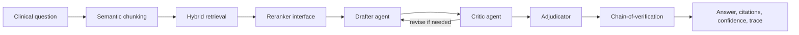

# Clinical Research Synthesizer

[](https://github.com/Ramakrishna9-R09/clinical-research-synthesizer/actions/workflows/ci.yml)
[](https://clinical-research-synthesizer.vercel.app)
[](https://clinical-research-synthesizer.vercel.app/docs)

Production-style clinical multi-agent RAG system for synthesizing conflicting medical evidence with retrieval, adversarial critique, adjudication, citations, verification, and audit traces.

**Live demo:** [clinical-research-synthesizer.vercel.app](https://clinical-research-synthesizer.vercel.app)

**API docs:** [clinical-research-synthesizer.vercel.app/docs](https://clinical-research-synthesizer.vercel.app/docs)

## Why This Project Exists

Naive RAG systems often fail when evidence conflicts. In clinical research, that is the hard part: one source may support an intervention while another flags contraindications, adverse events, weak sample sizes, or outdated evidence.

This project demonstrates an AI engineering pattern for safer synthesis:

1. Retrieve and rerank evidence.
2. Draft a cited answer.
3. Run a critic agent that hunts for contradictions.
4. Adjudicate using evidence hierarchy, recency, and sample size.
5. Verify citations before returning a final report.



## Recruiter-Friendly Highlights

| Capability | Implementation |
| --- | --- |
| Multi-agent orchestration | Drafter, critic, adjudicator, revision loop, shared state |
| Retrieval | Heading-aware chunking, hybrid scoring, reranker abstraction |
| Hallucination control | Citation verification, risk proxy, conservative fallback |
| Evidence grading | Study design, recency, sample size, contradiction weighting |
| API productization | FastAPI, OpenAPI docs, typed requests, structured JSON |
| UI | Hosted browser UI with summary, evidence, trace, and report tabs |
| DevOps | GitHub Actions CI, Vercel deploy, Docker support |
| Free tooling | Runs without paid APIs; optional Ollama, Tavily, LangGraph, Hugging Face |

## Example Response Shape

```json
{
  "answer": "Evidence is directionally supportive...",
  "confidence": 0.77,
  "evidence_grade": "moderate",
  "citations": ["C1", "C2", "C3"],
  "verification": {"is_verified": true},
  "execution_ms": 134,
  "agent_count": 3
}
```

## API

```powershell
Invoke-RestMethod `
  -Method Post `
  -Uri https://clinical-research-synthesizer.vercel.app/query `
  -ContentType 'application/json' `
  -Body '{"question":"Should eligible adults with heart failure receive an SGLT2 inhibitor?"}'
```

Useful endpoints:

- `GET /` hosted UI
- `GET /docs` OpenAPI docs
- `GET /health` health check
- `GET /graph` agent graph
- `GET /examples` sample prompts
- `POST /query` synthesis endpoint

## Local Development

```powershell
python -m venv .venv
.\.venv\Scripts\Activate.ps1
pip install -r requirements-full.txt
copy .env.example .env
pytest
uvicorn app.main:app --reload
```

Open `http://localhost:8000`.

## Optional Free Integrations

- **Ollama:** local LLM generation with `llama3.2:3b`
- **Tavily:** external contradiction search with free tier
- **LangGraph:** checkpointed HITL workflow in `app/graph/langgraph_workflow.py`
- **Hugging Face:** optional cross-encoder reranking
- **RAGAS:** replace the proxy evaluator with full metric scoring

## Docker

```powershell
copy .env.example .env
docker compose up --build
```

API: `http://localhost:8000`

Streamlit UI: `http://localhost:8501`

## Evaluation

```powershell
python evaluation/run_ragas_eval.py
```

The included script is a lightweight, free evaluation smoke test. For production use, connect an evaluator LLM and run full RAGAS metrics.

## Documentation

- [Architecture](docs/ARCHITECTURE.md)
- [Portfolio Brief](docs/PORTFOLIO_BRIEF.md)
- [Security and Safety](SECURITY.md)

## Safety

This project is for AI engineering demonstration and clinical literature synthesis research. It is not a medical device, does not diagnose or treat patients, and must be reviewed by qualified clinicians before any real clinical use.
