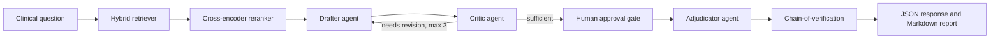

# Clinical Research Synthesizer

Production-style clinical multi-agent RAG system for synthesizing conflicting medical evidence with a drafter, critic, adjudicator, citations, and verification guardrails.



## What is included

- FastAPI backend with `POST /query`, `GET /health`, and `GET /graph`
- Streamlit UI at `localhost:8501`
- Semantic chunking by clinical headings
- Hybrid retrieval with BM25-style scoring plus lexical semantic overlap
- Optional Hugging Face cross-encoder reranking
- Local Ollama support with deterministic fallback when Ollama is unavailable
- Critic agent that checks local contradictory evidence and optionally Tavily
- Adjudicator that weighs recency, sample size, and study design
- Chain-of-verification and hallucination risk proxy
- Docker and Docker Compose
- Pytest workflow tests and evaluation harness
- Optional LangGraph compiler with `MemorySaver` and `interrupt_before=["adjudicator"]` in `app/graph/langgraph_workflow.py`

## Quick start

```powershell
python -m venv .venv
.\.venv\Scripts\Activate.ps1
pip install -r requirements.txt
pip install -r requirements-full.txt
copy .env.example .env
pytest
uvicorn app.main:app --reload
```

In a second terminal:

```powershell
streamlit run ui/streamlit_app.py
```

API docs: `http://localhost:8000/docs`

UI: `http://localhost:8501`

## Example request

```powershell
Invoke-RestMethod -Method Post -Uri http://localhost:8000/query -ContentType 'application/json' -Body '{"question":"Should eligible adults with heart failure receive an SGLT2 inhibitor?"}'
```

## Free tool setup

Ollama is optional but recommended:

```powershell
ollama pull llama3.2:3b
ollama serve
```

Tavily is optional. Add `TAVILY_API_KEY` to `.env` for external contradiction search.

Put clinical PDFs, Markdown, or text files in `data/`. If `data/` is empty, the app uses built-in seed documents so the demo still runs.

## Docker

```powershell
copy .env.example .env
docker compose up --build
```

API: `http://localhost:8000`

UI: `http://localhost:8501`

## Evaluation

```powershell
python evaluation/run_ragas_eval.py
```

The script prints lightweight proxy metrics by default. You can replace it with full RAGAS scoring after connecting an evaluator LLM.

## Safety

This project is for evidence synthesis and portfolio demonstration. It is not a medical device, does not diagnose or treat patients, and must be reviewed by qualified clinicians before any real clinical use.

## Vercel API deploy

The root `requirements.txt` is intentionally minimal for Vercel serverless deployment. Use `requirements-full.txt` for local UI, Docker, evaluation, and optional ML integrations.

```powershell
vercel --prod
```
