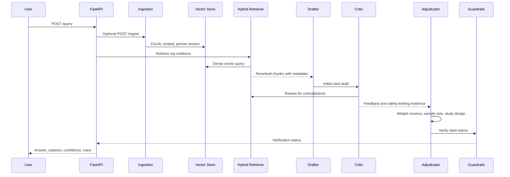

# Architecture

## Goal

This project demonstrates a clinical RAG workflow that does not simply retrieve sources and answer. It explicitly separates drafting, contradiction hunting, adjudication, verification, and audit logging.

## Runtime Flow

## Key Design Choices

- **Stateful agents:** the workflow keeps `query`, retrieved evidence, critic feedback, revision count, final report, and audit logs in a shared state object.
- **Ingestion/indexing:** PDFs and text files are parsed, semantically chunked, embedded, and indexed into ChromaDB when available.
- **Hybrid retrieval:** BM25-style lexical scores, dense vector search, and lexical semantic overlap are fused using reciprocal rank fusion.
- **Adversarial review:** the critic actively flags contraindications, adverse events, and weak contradictory evidence instead of assuming retrieved evidence is sufficient.
- **Evidence hierarchy:** adjudication weights systematic reviews, guidelines, RCTs, and case reports differently.
- **No paid dependency required:** the deployed serverless demo uses deterministic local logic. Local mode can add Ollama, Tavily, Chroma, and Hugging Face rerankers.
- **Clinical auditability:** every response includes citations, checked citation IDs, confidence, decision factors, and an agent trace.

## Production Extension Path

- Replace lexical semantic overlap with Chroma or Qdrant dense retrieval.
- Add Redis-backed response, embedding, and retrieval caching.
- Enable `app/graph/langgraph_workflow.py` for checkpointed HITL flows.
- Add LangSmith tracing using `.env`.
- Add RAGAS with an evaluator LLM for full faithfulness and context precision.
- Store reports and audit logs in Postgres or object storage.
